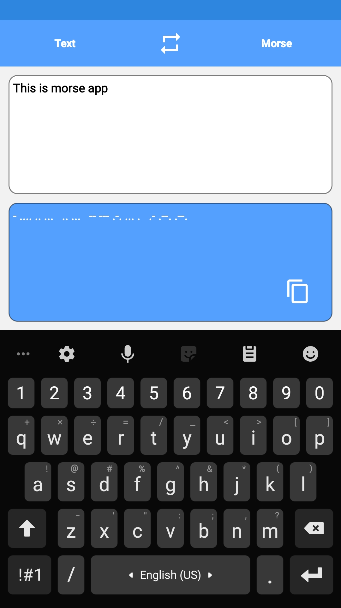
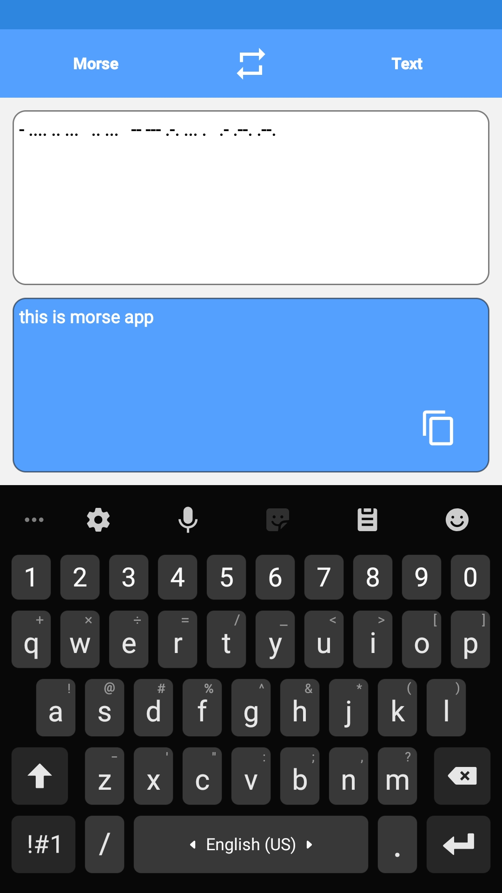

# android-morse

Simple morse code encoder/decoder app for android [Download](https://github.com/theshoqanebi/android-morse/releases/download/v1.0/app-release.apk)

build with gradle version `7.3.3-all` and android gradle plugin version `7.0.4` and android studio version `Arctic Fox | 2020.3.1 Patch 4`

|  |   |
| ---------------------------------------------- | -------------------------------------------- |
